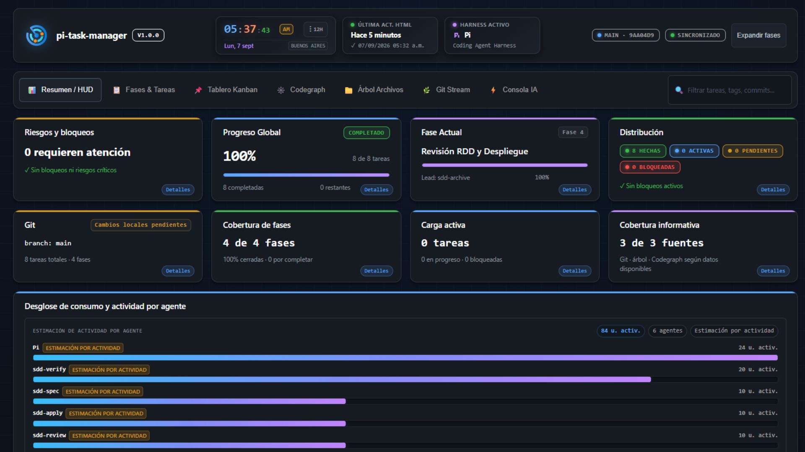
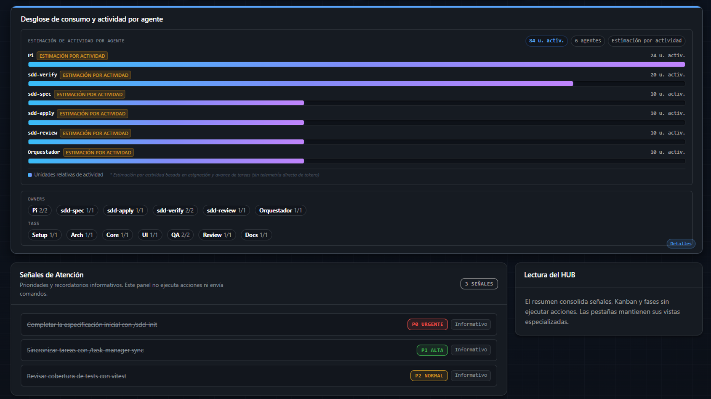
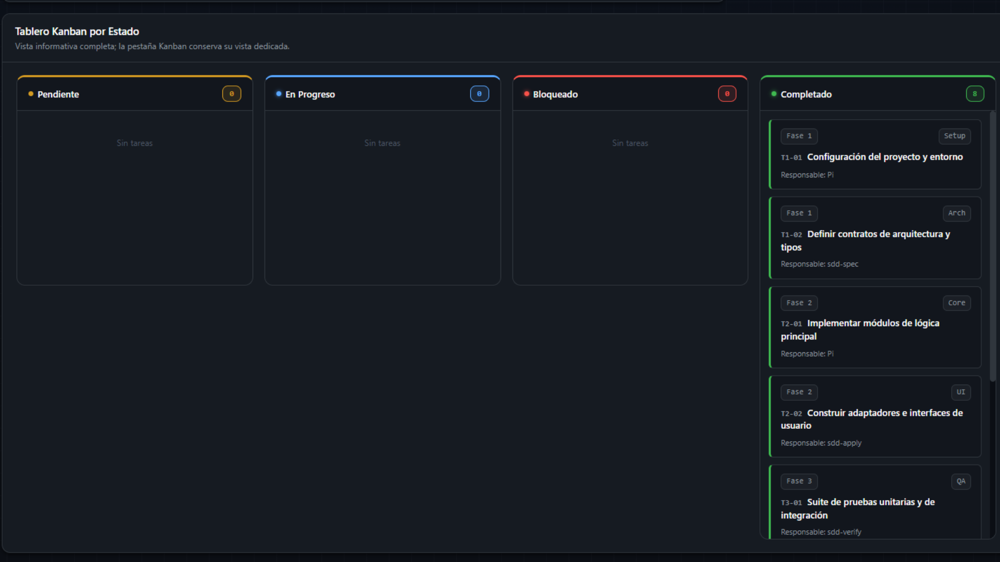
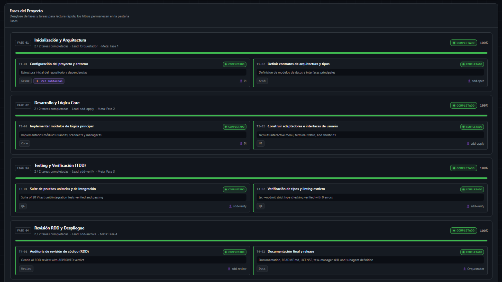

# Pi Task Manager (`pi-task-manager`)

> Technical cockpit, visual dashboard, and Pi coding agent extension for project task tracking, token telemetry, and Spec-Driven Development (SDD) phase management.  
> **Basado originalmente en el concepto de plugin y dashboard portable de [Ramón (@RamonsDka)](https://github.com/RamonsDka/opencode-sdd-profile-manager), adaptado, rediseñado y evolucionado para la arquitectura moderna de Pi.**


---

## 📸 Capturas del Cockpit Visual

### 1. Resumen General / HUD & Métricas del Proyecto
El centro de comando visual con métricas en vivo, estado de Git, reloj sincronizado, distribución de estados y cobertura informativa:



### 2. Telemetría de Consumo de Tokens por Agente & Señales de Atención
Monitoreo en tiempo real de tokens consumidos (Input, Output, Caché, Razonamiento) y costos exactos en USD desglosados por modelo y agente:



### 3. Tablero Kanban por Estado
Flujo visual dinámico con columnas por estado (*Pendiente*, *En Progreso*, *Bloqueado*, *Completado*) para auditar el avance del sprint:



### 4. Desglose de Fases SDD y Tareas Técnicas
Seguimiento paso a paso de fases de desarrollo (*Setup*, *Core*, *Testing*, *Review RDD*) con subtareas, responsables y commits asociados:



---

## ✨ Características Principales

### 1. Arquitectura Limpia y Cero Contaminación de Repositorios
* **Tus repositorios quedan 100% limpios**: En los proyectos de trabajo sólo se almacena un archivo liviano `.pi/task-manager.json` (~3 KB).
* **Sin archivos gigantes**: No se generan archivos HTML monolíticos de 7.000 líneas ensuciando tus commits, Git diffs o estadísticas de lenguaje en GitHub.
* **Visualizador efímero**: Al ejecutar `/task-manager open`, la interfaz se compila al vuelo en el directorio temporal del sistema (`os.tmpdir()`) y se abre en tu navegador predeterminado (Linux, macOS y WSL2).
* **Exportación on-demand**: Si necesitas compartir el dashboard estático o publicarlo offline, puedes exportarlo en cualquier momento con `/task-manager export`.

### 2. Modal Flotante TUI en la Terminal (<kbd>alt+t</kbd>)
* **Experiencia de ventana modal interactiva**: Diseñado con bordes dobles Unicode (`╔═╗`, `║`, `╚═╝`) y fondo violeta oscuro Obsidian (`#140a28`).
* **Todo el flujo sin salir del modal**:
  * 🌐 Abrir el visualizador en el navegador.
  * 🔄 Sincronizar Git y tareas en vivo.
  * 📋 **Lista interactiva completa**: Navega con flechas (`↑`/`↓`), y con <kbd>Enter</kbd> o <kbd>Espacio</kbd> tilda/destilda Todos o cambia de estado las tareas de fase directamente.
  * ➕ **Agregar Todos rápidos con prioridades inteligentes**: Detección automática de la siguiente prioridad libre (`P0` → `P1` → `P2` → `P3`) o selección manual mediante <kbd>Tab</kbd>.
  * ✏️ Modificar estados de tareas con recálculo de progreso inmediato.
  * 🚪 Salir limpiamente con <kbd>Esc</kbd>.

### 3. Telemetría Operativa Real de Tokens y Costos
* **Medición automática en runtime**: Se suscribe a los eventos del ciclo de vida de Pi (`turn_end`) capturando tokens de entrada, salida, lecturas/escrituras de caché y costo monetario.
* **Atribución por agente**: Asigna el consumo a la tarea activa o subagente (`sdd-apply`, `sdd-verify`, `Pi`, `Orquestador`).
* **Sincronización histórica**: Reconcilia la sesión activa desde el `SessionManager` de Pi durante `/task-manager sync`.

### 4. Herramientas Nativas para Agentes y Orquestador
* `task_manager_read`: Permite a la IA consultar tareas, fases y progreso actual.
* `task_manager_update_task`: Actualización atómica de estado, notas técnicas, responsables y commits asociados.
* `task_manager_sync`: Sincronización automática de archivos markdown (`tasks.md` / OpenSpec) y ramas Git.

---

## 🚀 Instalación y Configuración en Pi

### Enlace Local de la Extensión
Clona o enlaza este repositorio en tu directorio de extensiones de Pi:

```bash
# Crear enlace simbólico en tus extensiones de Pi
ln -s /ruta/a/pi-task-manager ~/.pi/agent/extensions/pi-task-manager
```

Recarga Pi o reinicia tu sesión:
```text
/reload
```

---

## 📖 Guía de Uso

### Atajo Rápido
Presiona **<kbd>alt+t</kbd>** en cualquier momento dentro de Pi para abrir la ventana modal interactiva en la terminal.

### Comandos de la CLI
```bash
/task-manager           # Abre el modal interactivo de gestión (alias: /tm)
/task-manager open      # Abre el dashboard visual en tu navegador predeterminado
/task-manager sync      # Sincroniza git commits, telemetría y tareas markdown
/task-manager status    # Muestra el resumen de métricas en la terminal
/task-manager list      # Lista completa de fases y tareas en la terminal
/task-manager add <txt> # Agrega una tarea rápida con prioridad auto-asignada
/task-manager export    # Exporta una copia de Task-Manager-Portable.html bajo demanda
```

---

## 🛠️ Desarrollo y Tests

```bash
# Ejecutar suite de pruebas unitarias y de integración
pnpm test

# Verificación estricta de tipos TypeScript
pnpm typecheck

# Ensamblar plantilla HTML portable para exportación
pnpm run assemble
```

---

## 👥 Reconocimientos y Créditos

Este proyecto está basado e inspirado en la visión original del plugin y panel de control portable creado por **[Ramón (@RamonsDka)](https://github.com/RamonsDka/opencode-sdd-profile-manager)**.  
A partir de esa base, se rediseñó la arquitectura para desacoplar el estado en `.pi/task-manager.json`, eliminar la contaminación de archivos HTML en repositorios, incorporar el modal flotante TUI en la terminal y conectar la telemetría operativa en tiempo real con el runtime de **Pi**.

---

## 📄 Licencia

Distribuido bajo la Licencia **MIT**. Consulta el archivo `LICENSE` para más detalles.
